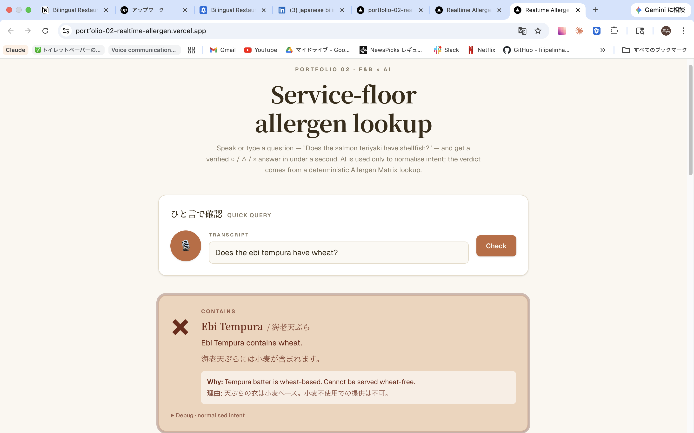
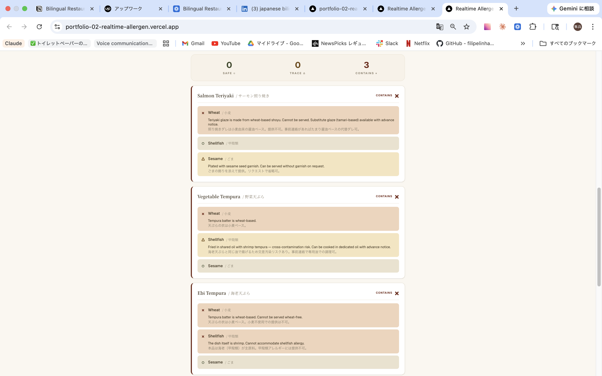

# Real-time Allergen Decision Support

**A service-floor web app where a server speaks "does this dish have shellfish?" and gets a verified ○ / △ / × answer in under one second — at SaaS-economical AI cost.**

- **Public case study:** [Notion](https://leeward-yard-638.notion.site/Real-time-Allergen-Decision-Support-Portfolio-Case-Study-35106134495680478174c28f9d28160f)
- **Live demo:** https://portfolio-02-realtime-allergen.vercel.app/
- **Demo video (90 seconds):** [Loom](https://www.loom.com/share/5d717e7f56394d5fb6e7596172726e6a)
- **Source code:** https://github.com/risicare-jp/portfolio-02-realtime-allergen

> **Status**: Live (deployed 2026-04-28). End-to-end voice → answer running in production on Vercel.

---

## See it in action



A typed or spoken question returns a verdict in under a second. The only AI call is intent normalisation; the verdict comes from a deterministic Allergen Matrix lookup.



For full-order checks, every dish is cross-referenced against every flagged allergy at once. No AI is involved in this path — it is pure Matrix lookup, so latency is sub-100ms and cost is zero.

---

## Why this exists

This is the deliberate counterpart to [Portfolio 1: Bilingual Restaurant SOP Generator](https://github.com/risicare-jp/portfolio-01-sop-generator). They share the same Allergen Matrix as a knowledge base but live in opposite economic regimes:

| | Portfolio 1 (SOP Generator) | Portfolio 2 (this) |
| :-- | :-- | :-- |
| Use case | Batch generation: click → wait → bilingual SOP doc | Realtime decision: voice → ≤ 1 second → ○/△/× verdict |
| AI weight | AI-heavy (Claude Sonnet 4.6 writes the document) | AI-light (Claude Haiku normalises intent only) |
| Cost / interaction | ~$0.11 per generation | ~$0.0003 per query (Haiku + cached system prompt) |
| Sustainable SaaS price | $300+/month | $30–150/month per shop |

Building both makes the differentiation concrete: **we know where AI belongs and where it doesn't**.

## Architecture (90/10 hybrid)

```
[Server's phone]
   │  voice or typed query
   ▼
[Web Speech API]                   ← browser-native, free, deterministic
   │  transcribed text
   ▼
[Claude Haiku: intent normaliser]  ← the only AI call (10% of the path)
   │  {allergen, scope, qualifier}
   ▼
[Allergen Matrix lookup]           ← Google Sheets API, deterministic
   │  {item, status: ○/△/×, notes}
   ▼
[UI verdict + voice readback]
```

90%+ of every interaction is deterministic. If the Anthropic API has a bad hour, a typed-query fallback with column-aware autocomplete keeps the lookup path live — restaurant floors cannot stop being usable because of a third-party outage.

## Stack

- **Framework**: Next.js 16 (App Router) + TypeScript + Tailwind CSS v4
- **Speech I/O**: Web Speech API (browser-native, zero cost)
- **Intent layer**: Anthropic Messages API — Claude Haiku, with prompt caching
- **Knowledge base**: Google Sheets API (same matrix shape as Portfolio 1)
- **Hosting target**: Vercel (PWA-friendly mobile delivery)

## Shipped (MVP)

- [x] Next.js + TypeScript + Tailwind project scaffold
- [x] Allergen Matrix integration — fetch and render
- [x] Claude Haiku intent normalisation — minimal prompt, prompt-cached system block
- [x] End-to-end voice → answer round-trip working in production
- [x] Multi-order safety check (orders × allergies grid)
- [x] Production deployment on Vercel
- [x] Loom recording for the Upwork portfolio entry

## Future work (parked, not abandoned)

- Offline mode (IndexedDB-cached matrix, PWA service worker)
- Multi-language voice input (Japanese / mixed JP-EN queries)
- Kitchen-side variant (cross-contamination warnings)
- HACCP-grade audit trail of every query

## Local development

```bash
npm install
npm run dev
```

The dev server runs at <http://localhost:3000>.

## License

To be added before public demo.
